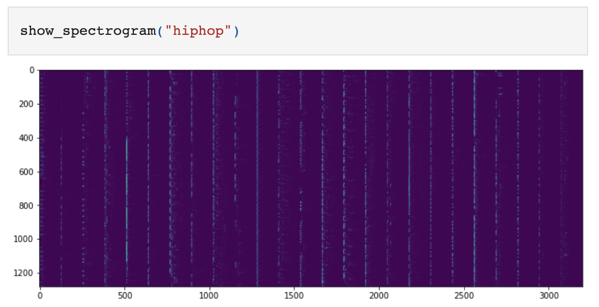
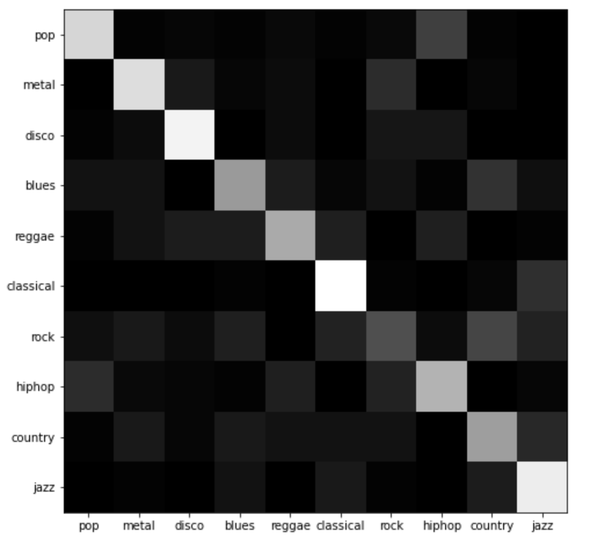
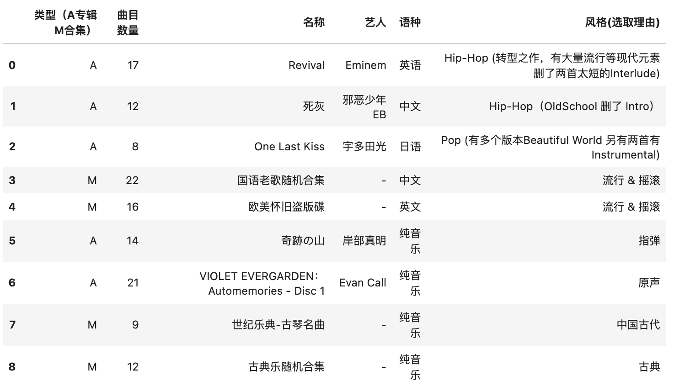
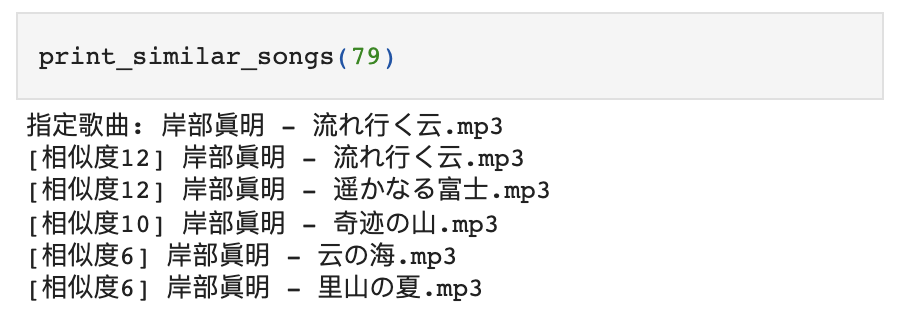
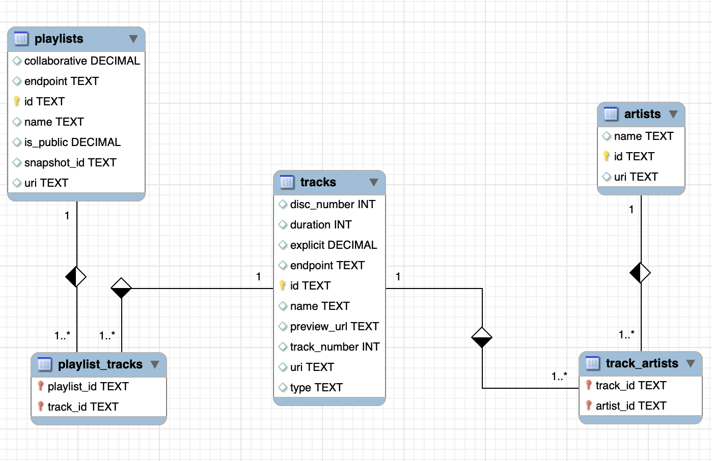
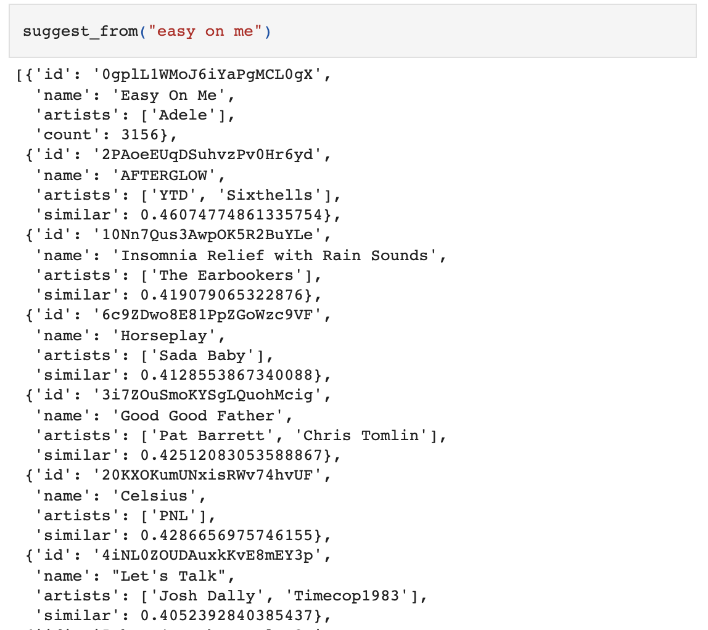
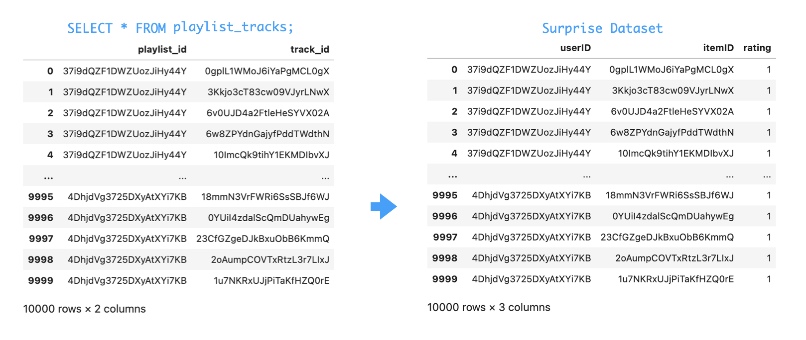

# murecom-intro

两种简单的传统音乐推荐系统（next-songs 方向）的思路与实现（数学原理和机器学习方法从略）。

## 1. 基于音频特征

分析音频特征，做基于内容的推荐（Content-Based Filtering，CBF)。

> song-classification.ipynb
>
> index-local-mp3s.ipynb

### 1.1 设计思路

一个喜欢巴赫的人可能也喜欢肖邦，所以一种自然的想法是，我们可以把音频送给机器进行学习，试图让它分别不同种类、风格的音乐。给定一首歌，送入训练好的模型，推荐出风格上最相近的其他歌曲。

`song-classification.ipynb` 实现了这种模型的训练。

加拿大维多利亚大学的 genres 数据集（http://opihi.cs.uvic.ca/sound/genres.tar.gz），提供了良好标注的不同种类音乐片段。

```sh
$ ls genres
blues     country   hiphop    metal     reggae
classical disco     jazz      pop       rock
```

我们把这些片段利用 librosa 库转化为**梅尔频谱图**（mel-spectrogram）。



(上图为数据集中 Hip-Hop 风格片段的平均频谱图)

把频谱送入一个一维卷积池化堆叠 + 全连接分类头的神经网络，训练，得到的模型即一个音乐风格检测器。

```python
def cnn_model(input_shape):
    inputs = Input(input_shape)
    x = inputs

    # 一维卷积池化
    levels = 64
    for level in range(3):
        x = Conv1D(levels, 3, activation='relu')(x)
        x = BatchNormalization()(x)
        x = MaxPooling1D(pool_size=2, strides=2)(x)
        levels *= 2

    # x -> shape(128)
    x = GlobalMaxPooling1D()(x)

    # 计算类型标签的全连接网络
    for fc in range(2):
        x = Dense(256, activation='relu')(x)
        x = Dropout(0.5)(x)

    labels = Dense(10, activation='softmax')(x)

    model = Model(inputs=[inputs], outputs=[labels])

    # optimizer and compile model
    sgd = SGD(learning_rate=0.0003, momentum=0.9, decay=1e-5, nesterov=True)
    model.compile(optimizer=sgd, loss='categorical_crossentropy', metrics=['accuracy'])

    return model


model = cnn_model((128, 128))
```

训练得出的模型 `song_classify.h5` 可以很好的分类特征明显的音乐类型（例如古典乐），但对界限相对模糊的乐种（如摇滚乐）分类效果欠佳。



(分类结果的混淆矩阵)

利用这个模型，在 `index-local-mp3s.ipynb` 中实现了相似音乐的推荐。

具体的做法是，手动做了一个简单的数据集，选取一些个人常听的音乐，转化为同样品质的 mp3 文件。



(选取的音乐种类)

遍历处理这些文件，提取梅尔频谱图。

```python
def process_mp3(path):
    signal, sr = librosa.load(path,
                              res_type="kaiser_fast",
                              offset=30,
                              duration=30)
    melspec = librosa.feature.melspectrogram(signal, sr=sr).T[:1280, ]
    if len(melspec) != 1280:
        return None
    return {'path': path,
            'melspecs': np.asarray(np.split(melspec, 10))}

# 对每个 MP3 的所有频谱进行索引
songs = [process_mp3(path) for path in tqdm(mp3s)]
songs = [song for song in songs if song]

# 可以把他们连在一起，方便一批完成
inputs = []
for song in songs:
    inputs.extend(song['melspecs'])
```

接下来将预处理好的数据集送入训练好的模型。

由于我们只需要提取音频特征，而并不需要做分类，所以把模型最后基层的全连接分类头去掉，只留下前面的卷积特征提取层。输入音频频谱，输出一个 256 维的向量作为音乐的“特征向量”。

```python
cnn_model = load_model('song_classify.h5')
vectorize_model = Model(inputs=cnn_model.input,
                        outputs=cnn_model.layers[-4].output)
vectors = vectorize_model.predict(inputs)
```

建立一个无监督的最邻近模型，计算这些特征向量的相似度，也就其代表的 mp3 歌曲的相似度。

```python
nbrs = NearestNeighbors(
    n_neighbors=10, algorithm='ball_tree'
).fit(vectors)

def most_similar_songs(song_idx):
    distances, indices = nbrs.kneighbors(
        vectors[song_idx * 10: song_idx * 10 + 10])
    c = Counter()
    for row in indices:
        for idx in row[1:]:
            c[idx // 10] += 1
    return c.most_common()

def print_similar_songs(song_idx, start=1, end=6):
    print("指定歌曲:", song_name(song_idx))
    for idx, score in most_similar_songs(song_idx)[start:end]:
        print(f"[相似度{score}] {song_name(idx)}")
```

最后，给定一首歌，就可以从最邻近模型中找到最接近的几首歌。



（推荐结果示例）

模型最终表现还行吧。只是和分类的结果类似，不善于处理摇滚乐。

### 1.2 模型优缺点

这是我比较喜欢的一种方式，从音乐本身的特征出发，不基于以往用户数据，没有曲目列表限制。借助训练好的分类器网络，可以对任意没见过的音频进行推荐。

但是，需要处理完整的音频。频谱分析的过程比较消耗算力。并且只能推荐本地拥有的曲目在另一方面也可以看作一种限制。

这种模型可以用于离线的设备端音乐推荐。

### 1.3 改进空间

1. 用于训练分类器的 genres 数据集虽然质量极高，但数据量不太大。考虑用更多数据，或许能得到更好的模型；
2. 分类器网络的结构也比较粗糙，可以考虑进一步研究调整。例如考虑使用预训练的 NLP 模型进行迁移学习，或许能更加敏锐；
4. 考虑构建多输入的模型（或者使用多个模型），加上一些其他方面的数据，比如歌曲的元数据（歌名、艺人、专辑、时常等）、以及歌词等不容易从频谱中得出的方面。

## 2. 基于现有播放列表数据

基于以往的、其他用户的数据，做**协同过滤**（Collaborative Filtering ，CF) 。

> spotify/
>
> spotify-100/
>
> spotify-playlist.ipynb
>
> train-a-music-recommender.ipynb
>
> surprise.ipynb

这种思路其实更常见。获取一系列的人建好的播放列表。通过某种方法建立其中曲目的距离关系。给定歌曲，推荐距离最近的。

### 2.1 获取数据

在 `spotify-playlist.ipynb` 中，利用 Spotify 的 API，随机获取一些播放列表，及其中曲目（只是获取元数据，不下载音频）。

但由于这种方法需要获取大量数据（需要数十万歌曲），而网络、数据库环境都有限制，Python 实现不甚稳定，难以完成工作，所以在 `spotify/` 子目录中，使用 Golang 重写了这个实现，提供更加鲁棒的数据获取服务，将获取的数据存放在一个 SQLite 数据库中。



（获取的播放列表及曲目数据）

这里目前获取了数 GiB 数据，包含 17 万个播放列表中，来自 80 万个艺人的近 500 万首歌曲。

```sql
sqlite> select count(*) from playlists;
177889
sqlite> select count(*) from artists;
801357
sqlite> select count(*) from tracks;
4995249
```

下面实现了两种思路来利用这些数据：

### 2.2 Word2vec

在 `train-a-music-recommender.ipynb` 中，将**歌曲作为单词**、将歌曲最成的**播放列表作为句子**:

```python
sentences = [
    ["track_1_id", "track_2_id", ...], # playlist_1
    [...], # playlist_2
    ...
]
```

以此为语料，建立 Word2vec 模型。

```python
model = gensim.models.Word2Vec(
    sentences=PlaylistTracksIter(DB), min_count=4)
```

训练完成后，给定曲目，可获取到最接近的推荐。

```python
def suggest_songs(song_id):
    similar = dict(model.wv.most_similar([song_id]))
    song_ids = ', '.join(("'%s'" % x) for x in similar.keys())

    c = conn.cursor()
    c.execute("SELECT * FROM tracks WHERE id in (%s)" % song_ids)

    res = sorted((rec + (similar[rec[4]], 
                         find_artists(rec[4])
                        ) for rec in c.fetchall()),
        key=itemgetter(-1),
        reverse=True)
    return suggest_songs_result([*res])

def suggest_from(song_name: str):
    s = find_song(song_name, limit=1)
    return s + suggest_songs(s[0]["id"])
```

这个模型也可用，但效果不算特别理想。



（Word2Vec 模型推荐实例）

### 2.3 Surprise KNNBaseline

在 `surprise.ipynb` 中，将歌曲作为 item，将播放列表作为 user，播放列表包含某歌曲即看作 user 给 item 打了一分（rating=1）。



将这样处理好的数据集交给 Surprise 进行基本的**协同过滤**。

```python
from surprise import KNNBaseline
from surprise import Reader, Dataset

# custom dataset
reader = Reader(rating_scale=(0, 1))
train_data = Dataset.load_from_df(
    pt_train[['userID', 'itemID', 'rating']],
    reader)
trainset = train_data.build_full_trainset()

# compute  similarities between items
sim_options = {
    'user_based': False
}

# 算法、训练
algo = KNNBaseline(sim_options=sim_options)
algo.fit(trainset)
```

同样得到 KNN 的模型，给定歌曲，从模型中获取最邻近的推荐。

```python
def find_sim(track_id, k=5):
    sim = algo.get_neighbors(
        iid=algo.trainset.to_inner_iid(track_id), k=k)

    track_ids = [track_id] + list(
        map(algo.trainset.to_raw_iid, sim))

    tracks = []
    c = conn.cursor()
    for tid in track_ids:
        c.execute(f"SELECT * FROM tracks WHERE id = '{tid}'")
        tk = c.fetchall()[0]
        tracks.append(tk + (find_artists(tid),))
    c.close()

    return sim_result(tracks)
```

这个做出来效果不错。


(Surprise 模型推荐结果，Shout Baby 是输入的歌曲，下面 5 首是推荐出的，均为 J-Pop，大多数 ACG 相关，编曲上各有相似。)

### 2.4 模型优缺点

这种思路是传统的过往用户数据分析，是推荐系统比较常规的实现方式，方案较为成熟。基于海量数据，可以达到比较好的推荐效果。

但是，大数据的处理速度可能较慢，并且存储器开销不是终端可以承受的。同时，对于用户，基于数据的邻近推荐会容易造成信息茧房问题，并不健康。

这种方案可以用于云端的音乐推荐。

### 2.5 模型改进

1. 算法：目前实现的是最基本的基准算法，可以考虑尝试其他的算法。
2. 数据：对于这种模型更多的数据几乎一定会带来更好的结果。
3. 考虑抓取网易云音乐的数据，可能更优质：本土化音乐，评论、热度、播放列表标签分类。可以用更综合的模型进行推荐

## 3. TODO

接下来，考虑收集网易云的数据。

对评论信息进行 NLP 情感分析，应该可实现一种简单的基于心情的音乐推荐系统，即给定某种心情，推荐出合适的歌曲（first-song）。然后，利用前面两种思路，可以实现从本地或云端推荐相似曲目（next-songs）。这样应该就能形成一个比较好的符合心情的列表。

这个想法计划在 `murecom-verse-1` 中实现。

## 参考文献

[1] Douwe Osinga. Deep Learning Cookbook[M]. O'Reilly, 2018: 210-227.

[2] Nicolas Hug. Surprise: A Python library for recommender systems[J]. Journal of Open Source Software, 2020, 5(52): 2174.
